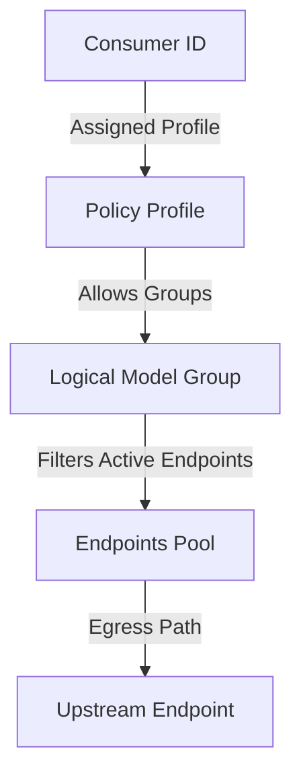

# Policy and Routing Model

This document defines the routing, scoping, and selection engine models.

## Layered Selection Path

Requests progress through four distinct layers to identify eligible endpoints:

### 1. Consumer to Profile Mapping
- Consumers are mapped to a `PolicyProfile` via `profile_id`.
- If no profile is mapped, access is blocked by default.

### 2. Profile to Logical Model Groups
- A Policy Profile lists the allowed logical model groups (e.g. `["premium", "general-chat", "embedding"]`) in JSON format.
- Restricts the virtual key generated on each node to this scope.

### 3. Model Group to Candidate Endpoints
- The Policy Engine filters all endpoints mapped to the requested logical group.
- Discards endpoints based on health and overrides:
  - Excludes `disabled`, `cooldown`, or `degraded` endpoints.
  - Excludes endpoints with inactive or cooldown accounts.
  - Honors `force-active` manual overrides (bypasses endpoint/account health, except account `disabled`/`inactive`).
  - Honors `force-disabled` overrides.
